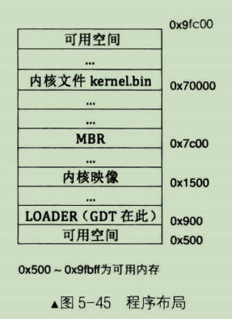
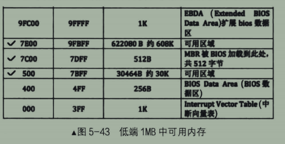

## 到本章为止的内存布局

## 低端1MB中的可用内存

# CPL、DPL、RPL 总结

## 基础概念

- **CPL**: 当前特权级(Current Privilege Level)，存储在 CS 段寄存器的 RPL 位。
- **DPL**: 描述符特权级(Descriptor Privilege Level)，存在于段描述符(GDT表中每8个字节的结构体称作为段描述符)中。
- **RPL**: 请求特权级(Requested Privilege Level)，存在于段选择子(也就是段寄存器,DS、ES、SS)中。

## 访问控制与安全检查

CPU 在执行代码时，代码必然处于某个段（segment）中。这时，CPU 的 CPL 是由 CS 寄存器中的 RPL 位决定的。当代码需要跳转到另一个段时，会加载该段的选择子（selector）并在 GDT 中查找相应的段描述符。

## 受访者为数据段与代码段

- **数据段**: 对于受访者为数据段（段描述符中type字段中未有X可执行属性）来说：

    只有访问者的权限大于等于该DPL表示的最低权限才能够继续访问，否则连这个门槛都迈不过去。
    
    比如，DPL为1段描述符，只有特权级为0，1的访问者才有资格访问它所代表的资源，特权为2，3的访问者会被 CPU 拒之门外。
- **代码段**: 对于受访者为代码段（段描述符中type字段中含有X可执行属性）来说：

    只有访问者的权限等于该DPL表示的最低权限才能够继续访问，即只能平级访问。任何权限大于或小于它的访问者都将被 CPU 拒之门外。

### 例外与特殊场景

仅仅依靠 CPL 和 DPL 是不足够的。比如，一个应用通过系统调用想要访问操作系统的数据，这是不允许的。在这种情况下，还需要引入 RPL 进行更精细的控制。

> **示例**: 如果应用的 CPL 是 3，但是加载到 DS 寄存器中的段描述符的 RPL 是 0，CPU 会识别这种不匹配，并将 DS 寄存器中的 RPL 改为与 CPL 相同。

[参见这篇文章](https://zhuanlan.zhihu.com/p/410107674)

## CPL 的初始化

CPU 的初始 CPL 是在保护模式开启时初始化的。具体流程如下：

1. BIOS 加载 MBR。
2. MBR 加载并执行 loader。
3. 使用 `jmp 0:loader_start` 与 `jmp SLE_CODE:p_mode_start` 语句刷新流水线。
4. CPU 将当前的 CS 值（全 0）当作段描述符选择子，其中的 RPL 位设置为 0。
5. 跳转成功后，新段的 CS 寄存器的 RPL 位会成为 CPU 的新 CPL。

## 一致性代码段

一致性代码段可以让低特权级代码访问高特权级代码，但不会改变 CPU 的 CPL。这里的 DPL 实际上作为访问的特权级上限。

> **示例**: 如果 DPL=1，那么 CPL=1,2,3 都可以访问。

## 其他特性

同样的逻辑也可用于 `eflags` 的 IOPL 位和 IO 位图，以实现对硬件端口操作的安全性检查。

